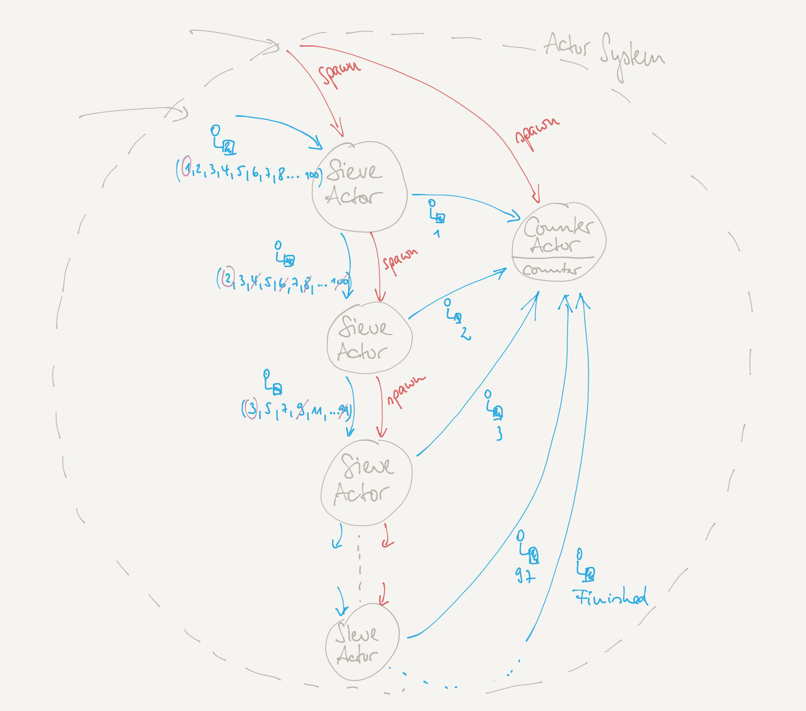

# Actors Lab Unit "Sieve of Eratosthenes"

Make yourself familiar with the ["Sieve of Eratosthenes"](https://en.wikipedia.org/wiki/Sieve_of_Eratosthenes).
It is the goal of this lab unit to create an actor system with a pipeline of actors that implement a version of such a "sieve".

> **N.B.:** This lab unit takes Erastosthenes as an example in order to get a closed set of requirements for a first actor system.
In such a first approach it is neccessary to get used to behavior definition, message definition, actor creation, and the passing and receiving of messages.
It is not the intention of this example to show any multi-threading or performance optimized calculation of prime numbers. It is not! 

## Your Tasks

### Project setup and implementation

In a simple actor system there could be an actor for each prime number (and the removal of its multiples) in a range of integer numbers,
where each actor creates a new "next" one. A dedicated singleton actor could count the number of prime numbers.

As before, the given original range of integers could be created using the `Range` object. 
Dealing with the first element and the rest of the elements is usually done by *pattern matching* with case classes that provide a `head` and a `tail` value. 

### Question(s)

- Does this setup has an advantage over a single-threaded solution? 
If so, explain what it is, if not, explain why not and what would need to change in order to get an advantage.
