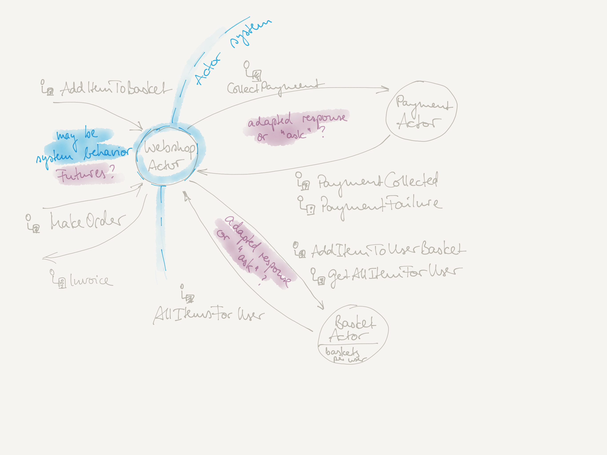

# Actors Lab Unit "Webshop"

The backend system of a retailer could be implemented using the actor model. 
In such an environment the "use cases", "services", or "service operations" (whatever is your design guideline) are represented as
stateful or stateless actors.

In a first and very simple setup of such a "webshop actor backend" could look like this:

## Your Tasks

### Project setup and implementation

- Define global entities like `Item`, `User`, `Payment`, and `Order` separately, as they may be payload to various actor's messages (may be done in an `object Entities`)
- Define all necessary actors and messages in order to 
  - add and retrieve items in a "shopping basket" for a user, this actor should be stateful (for now, with no further child actors) 
  - simulate a payment with an external payment provider
  - place a new order (which retrieves the stored item of the user's basket, makes the payment, and returns a full order object to the "external client")
- Use the concepts "adapted response" and/or "asking" where appropriate 

### Question(s) and further thoughts

- In a later stage the `WebshopActor` could be implemented as the interface to the webshop actor system:
  - What API technologies do you know and/or recommend to use here (and why)?
  - Are there any specific problems to be solved here, given the nature of actor systems or the actor model?
- Let's say the `BasketActor` or `PaymentActor` would use a blocking database API to store data to an external database.
Is this possible? If no, why not? If yes, are there any problems involved and how would you solve them?