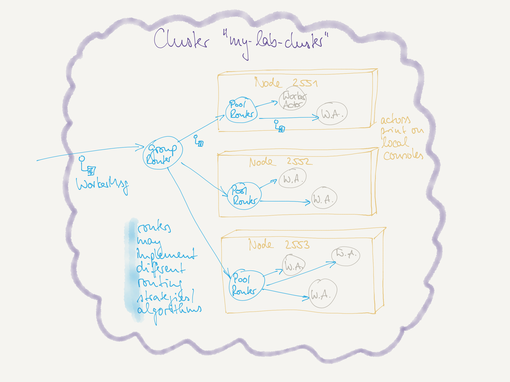

# Actors Lab Unit "Clustered" (Cluster-aware Routing)

## Overview

In this lab unit you should set up a small test cluster named **my-lab-cluster** that enables cluster-aware routing.
In this cluster we have nodes that all run some `WorkerActor` instances.
`WorkerActor`s are all behind a local router which is behind a cluster-wide router:

## Your Task(s)

### Actor and router definition

`WorkerActor`s do only one thing: they print the message received on console. This way you see what actor on what node got the message.
Set up such a simple behavior and define a message type for it.

Define the router behaviors for the local routers and the "global" router.

> **N.B.** *Pool routers* create their routees automatically, but only locally.
> *Group routers* use *Actor Discovery* in order to identify the routees that share a common *Service Key*.
> In a clustered system, *Actor Discovery* automatically works cluster-wide without any changes to the source code: Simply use the `context.system.receptionist` as before. 
> A combination of both router types makes routing "cluster-aware".

### Cluster start-up

Your cluster may be one that runs on one single machine (`localhost`). 
In order to start a new node, you simply need to set a new `akka.remote.artery.canonical.port` in the `application.conf` file
and start a new process.

If you want to implement different behavior at start-up, you can read the `port` value from the configuration and use a simple `if() else` expression.

It is probably best to start different terminal windows and start `sbt` there and issue the `run` command.

Inform yourself about the different *routing strategies* like *random routing* or *round robin* and make tests with the different strategies. 

### Question(s)

- How can you add or remove nodes to the cluster? How would you roughly implement it? (Check the documentation!)
- For the cluster-aware group routers: how do they learn about routees that join or leave the cluster? What do you need to implement (if at all)?
- In what way is "cluster-aware routing" different form "fork-join pools"? For what kind of "workers" or "tasks" is this appropriate? (Or not?)