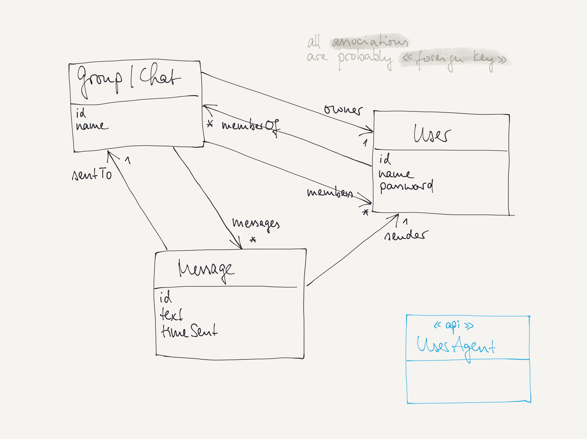

# Project "WhatsUp?!"

This project is intended as a "playground" to discuss, design, and implement a messaging application
with a functionality that you know from using *WhatsApp*, *Signal*, *Threema*, or similar providers.

## Domain Model

The domain model below shows a simplified messaging domain with the most prominent entities.

## Project Description

The above domain model can be implemented in different ways in a reactive actor system.
The domain entities could be a basis for

- **a stateful actor**, possibly in a **cluster sharding** environment
- **a persistent actor**, also possible to be *sharded*
- **a cluster singleton actor**
- **an actor's message type** (command, request, response, event, ...)
- **a domain object** that is used in various types and/or actors (usually implemented as `case class`)
- **a "normal" actor** (probably stateless)
- **a actor** representing a special role such as keeping a connection to a user agent
- **a database** entity like in a relational or No-SQL database

On top of this we also discussed concepts like

- **Message Distribution**
- **Service Discovery**
- **Routing** both, cluster-aware or local
- **Supervision**
- **Event Sourcing** and **Command-Query Responsibility Segregation**
- **"Asking" messaging capabilities** such as the *Ask Pattern* and *Askable Extensions* with *Futures*

### Actor System Design

Take the above ideas and concepts to design a reactive, actor based messaging system. 
Discuss the different possibilities in your group. And remember: there is not "the one" solution. 
Not every possibility makes sense, but sometimes it could be seen or implemented in one or another fashion. 

### Cluster Sharding

The last topic discussed was *Cluster Sharding*. 
In this scenario the `Group` (or `Chat`) entities could be managed as *sharded* actors.

In a first version implement a simple system where the `Group` (or `Chat`) entities are stateful actors
that are managed using *Cluster Sharding*.
In this simplified scenario it should be possible to 
- send a `Message` to a `Group` (or `Chat`) and 
- get `Message`s (either in a pull or push fashion).

Afterwards you could extend this scenario and make the actors *persistent* implementing the `EventSourcedBehavior`.
(The *LevelDB* journal would not be appropriate here anymore; for testing reasons keep it that way).

### API and Client Integration

Until now the actor systems were tested on a very simple level with messages being sent from the `main` method.

Discuss the different API and remoting technologies you know from other applications and evaluate what technology
would fit an actor system.

Use such a technology and implement it, so you can interact from "outside" with your messaging application.

### Node Roles

When setting up a (test) cluster by starting different nodes, these nodes can be assigned different *roles*.
This is done using the (local) configuration or environment variables.

In the application's configuration the role(s) of a node is defined in  
`akka.cluster.roles = ["role_1", "role_2"]`

This role information can be used when starting a node. The following documentation shows you how:
[Cluster Usage Node Roles](https://doc.akka.io/docs/akka/current/typed/cluster.html#node-roles)