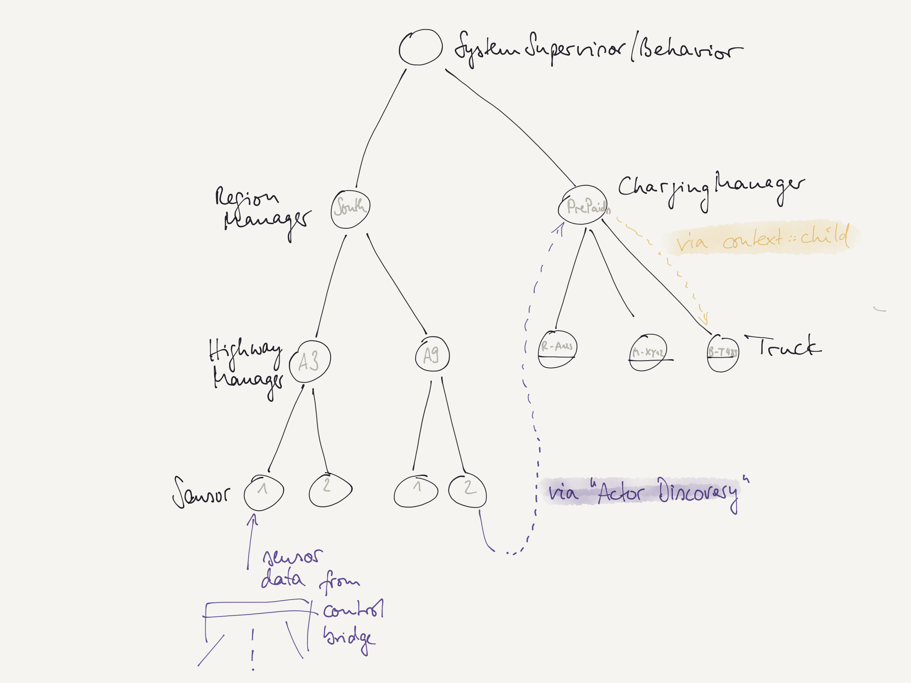

# Actors Lab Unit "Toll" (Supervision)

## Remarks

- To make a `HighwayManagerActor` fail, send a message like `system ! "fail-A3"`
- **Actor Discovery** is implemented between `SensorActor` and `ChargingManagerActor`
- The `SensorActor` uses a [Stashed Behavior](https://doc.akka.io/docs/akka/current/typed/stash.html)
  - During setup `SensorActor` subscribes for actor reference(s) of `ChargingManagerActor`
  - Until it does not receive such an actor reference, its initial behavior stashes (stores) all other messages for later processing
  - After receiving the actor reference, it un-stashes all stashed messages and switches to a "normal" behavior 

## Sketch

