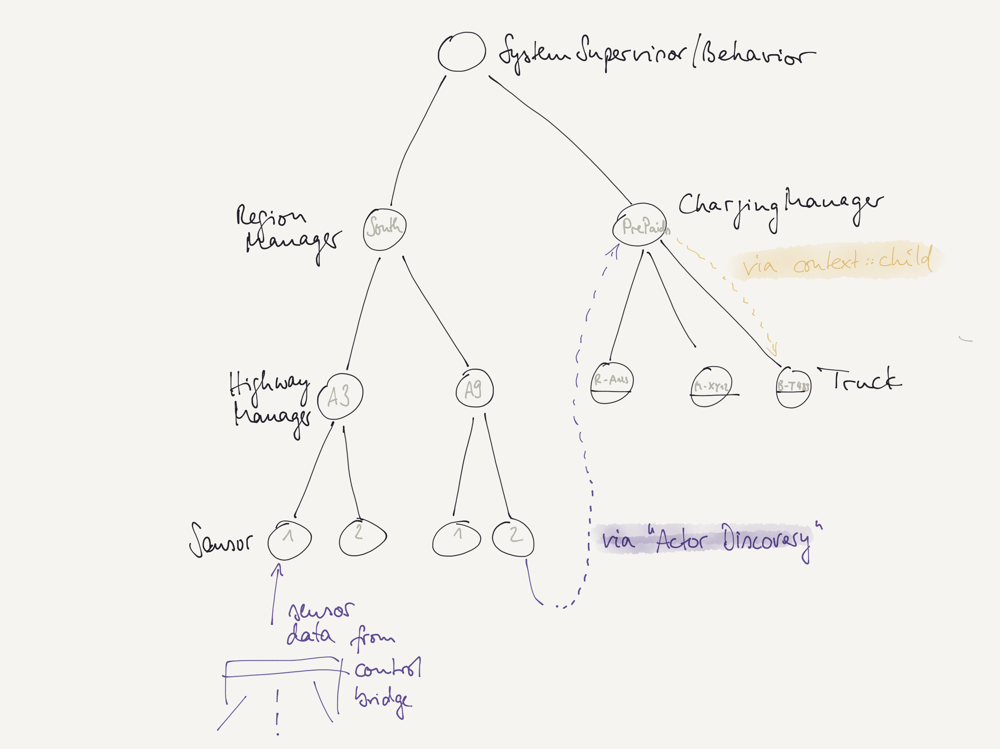

# Actors Lab Unit "Toll" (Supervision)

In this lab unit we design an extremely simplified system that helps to collect the highway toll for trucks.
Here, we will only focus on the supervision and discovery of actors.

## Some Thoughts on Highway Toll

In Germany, toll has to paid by trucks for the usage of the highway by the kilometer. 
Therefore, there are several sensors (so-called "control bridges", see picture below) on the highway, which trucks have to pass.
With every passage they send an event with the truck and sensor identification to the system.

At the end, the sensor events for a truck identify its route and thus its toll.
If the toll is pre-paid, the system can check the sensor events agains the pre-paid route.
In case the company owning the truck has a plan with the toll company, they will just be charged for this new route.


## Your Tasks

### Actor Hierarchy Setup

Set up the actors in the given hierarchy of sensors and highway/regions (see sketch below, left part). 
For simplicity and test reasons, the actors here should only receive and send `String` messages:

````scala
system ! "hello-A3-1"           // debug message that prints log message(s)
system ! "hello-A9-1"
system ! "fail-A9"              // lets an actor fail (throw new Exception())
system ! "hello-A3-1"     
system ! "hello-A9-1"           // can test, whether a stopped, restarted, or resumed A9 actor would forward this message
system ! "sensor-A9-2-R AB 123" // could be used later, see section "Actor Discovery" below
````

Actors could be organized like this:



### Actor Supervision Tests

After the actors are set up, you can add supervision behavior to the `HighwayManagerActor` and/or other actors.
Check out the different `SupervisionStrategy` options (`resume`, `restart`, and `stop`) 
and also add a behavior that can receive and print signals `PreStart` and `PostStop`.
Run different test cases and see whether the actors (based on the logging output) behave as expected.

> **Some notes on supervision**: If actors are re-started, only the `PreRestart` signal is sent, not the `PostStop` to the old instance.
> A restarted actor gets its initial behavior re-assigned. This is the one provided with the call of `spawn` (which is stored by the context for a restart).
> If you use `Behaviors.setup`, be careful when spawning child actors there since they may still exist. 
> Check, whether `context.child(...)` could be useful.

> **Dead Letters**: Message that can not be sent to a valid inbox are sent to a *Dead Letters* inbox.
> In case your test produces *Dead Letters* (Akka's logging will inform you about it, but does not show the message's contents) 
> you can set up an actor that will receive `DeadLetter` messages from the system's `EventStream`. 
> There is already a working `DeadLetterReaderActor` that shows you how to subscribe to *Dead Letters*.

### Actor Discovery

In the example above a `SensorActor` must be able to send `RouteUsageEvent` messages to a `ChargingManagerActor`.
The `ChargingManagerActor` does not know the `ActorRef`-instances of this *charging manager*. 
*Actor Discovery* (together with a `ServiceKey`) can be used here to subscribe to this service of the `ChargingManagerActor`.

A view things have to updated here, for example: Actor type `SensorActor[String]` needs a complex type now like 
`SensorActor[SensorRequest]` since this actor receives now messages from two different channels: from `HighwayManagerActor` and the `Receptionist`.

The `ChargingManagerActor` can forward the message to the appropriate child actor. The method `child(name: String)` 
can be used here.
